# 🚀 fridacli - 专业级 Frida Hook 工具集（2024 新任务系统 | 已在 Python 3.8 验证）

一个集成了 **Java Hook**、**Native Hook** 和 **定位Hook** 的强大 Frida CLI 工具，提供交互式调试环境和智能应用管理功能。

## ✨ 核心特性

- 🎯 **智能应用连接** - 自动检测前台应用或选择目标应用
- 📱 **多种连接模式** - 支持附加(attach)和启动(spawn)模式  
- 💻 **交互式JavaScript Shell** - 内置智能补全和命令历史
- ☕ **完整Java Hook套件** - 类跟踪、方法Hook、对象分析
- 🔧 **强大Native Hook工具** - SO分析、加密算法Hook、网络监控
- 📍 **精准定位Hook** - Base64、Toast、HashMap等常用组件Hook
- 🔥 **高级追踪功能** - 基于r0tracer的反调试绕过、批量Hook、对象字段检查
- 📋 **任务管理系统（新）** - 每个 Hook 独立脚本任务，killall 真正清理、无残留
- 🤖 **自测与自动任务** - 提供 `selftest_all` 一键验证，命中日志以 [#任务ID] 标记
- 🚀 **自动环境检测** - 智能检测Python和Frida版本
- 🎨 **Rich界面** - 美观的表格显示和彩色日志输出
- 🧩 **插件化扩展** - 支持独立插件脚本（如 OkHttp Logger 插件）按需加载

## 📋 系统要求

- **Python** 3.6.8+ 
- **Frida** 14.0.0+
- **Rich** 10.0.0+ (可选，用于美化界面)
- **iOS/Android** 设备连接

## 🚀 快速安装

### 方式一：全局安装 (推荐)

```bash
# 克隆项目
git clone <your-repo-url>
cd fridac

# 安装依赖
pip install frida>=14.0.0 rich>=10.0.0

# 全局安装
sudo cp fridac /usr/local/bin/fridac
sudo chmod +x /usr/local/bin/fridac

# 复制（或确保可访问）Hook 工具脚本（含插件）
sudo cp frida_common_new.js /usr/local/bin/frida_common_new.js
sudo cp frida_native_common.js /usr/local/bin/frida_native_common.js
sudo cp frida_location_hooks_new.js /usr/local/bin/frida_location_hooks_new.js
sudo cp frida_okhttp_logger.js /usr/local/bin/frida_okhttp_logger.js
```

### 方式二：本地使用

```bash
# 直接使用
chmod +x fridac
python3 fridac --help
```

## 💡 使用方法

### 基本命令（建议使用 Python 3.8 前台启动）

```bash
# 🎯 智能模式 - 自动连接前台应用
python3.8 /Users/chennan/fridac/fridac

# 📱 应用选择 - 显示应用列表供选择
python3.8 /Users/chennan/fridac/fridac -a

# 🚀 启动模式 - 启动指定应用并连接
python3.8 /Users/chennan/fridac/fridac -f com.example.app
python3.8 /Users/chennan/fridac/fridac --spawn com.example.app

# 🔗 附加模式 - 连接到已运行的应用
python3.8 /Users/chennan/fridac/fridac -p com.example.app

# ℹ️ 版本信息
python3.8 /Users/chennan/fridac/fridac --version
```

### 交互式使用（新任务命令 + 自测）

连接成功后，您将进入功能强大的交互式环境：

```javascript
// 📚 查看完整帮助
help()

// ⚡ 一键自测（定位Hook全套，自动触发并打印命中）
selftest_all

// 🎯 智能Hook - 自动识别Java/Native
smartTrace('com.example.MainActivity')  // Java类
smartTrace('malloc', {showArgs: true})  // Native函数

// 🌐 OkHttp Logger 插件（抓包与重放）
okhttpFind()
okhttpSwitchLoader('okhttp3.OkHttpClient')
okhttpHold()
okhttpHistory()
okhttpResend(3)
okhttpClear()

// ✅ 一键启动（可选过滤/可选ClassLoader样本）
okhttpStart()
okhttpStart('api/')
okhttpStart({ filter: 'api/', loaderSample: 'okhttp3.OkHttpClient' })
```

## 🔧 完整函数列表（命令行风格，括号可选）

### ☕ Java层Hook函数

| 函数名 | 描述 | 使用示例 |
|--------|------|----------|
| `traceClass()` | 🏢 跟踪类的所有方法 | `traceClass('com.example.MainActivity')` |
| `traceMethod()` | 🎯 跟踪特定方法 | `traceMethod('com.example.Class.method', true)` |
| `findClasses()` | 🔍 查找匹配的类 | `findClasses('MainActivity', true)` |
| `enumAllClasses()` | 📜 枚举所有已加载的类 | `enumAllClasses('com.example')` |
| `describeJavaClass()` | 📋 描述Java类的详细信息 | `describeJavaClass('java.lang.String')` |
| `printStack()` | 📚 打印Java调用栈 | `printStack()` |
| `findTragetClassLoader()` | 🔧 查找目标类加载器 | `findTragetClassLoader('com.example.Class')` |
| `findStrInMap()` | 🗺️ 监控HashMap查找key对应value | `findStrInMap('password', 1)` |

### 📍 定位Hook函数（新任务系统）

| 函数名 | 描述 | 使用示例 |
|--------|------|----------|
| `hookbase64` | 🔤 Hook Base64 编解码 | `hookbase64 1` |
| `hooktoast` | 🍞 Hook Toast 显示 | `hooktoast 1` |
| `hookjsonobject` | 📄 Hook JSONObject 操作 | `hookjsonobject 1` |
| `hookhashmap` | 🗺️ Hook HashMap 操作 | `hookhashmap key 1` |
| `hookedittext` | ✏️ Hook EditText 输入 | `hookedittext 1` |
| `hookarraylist` | 📝 Hook ArrayList 操作 | `hookarraylist 1` |
| `hookloadlibrary` | 📚 Hook 动态库加载 | `hookloadlibrary 1` |
| `hooknewstringutf` | 🆕 Hook JNI 字符串创建 | `hooknewstringutf 1` |
| `hookfileoperations` | 📁 Hook 文件操作 | `hookfileoperations 1` |
| `hooklog` | 📜 Hook Log 输出 | `hooklog 1` |
| `hookurl` | 🌐 Hook URL 请求 | `hookurl 1` |

### 🔧 Native层Hook函数

| 函数名 | 描述 | 使用示例 |
|--------|------|----------|
| `nativeHookNativeFunction()` | 🔧 Hook Native 函数 | `nativeHookNativeFunction('malloc', {argTypes: ['int']})` |
| `nativeFindModules()` | 📦 查找加载的模块 | `nativeFindModules(/libc/)` |
| `nativeFindExports()` | 📤 查找模块导出函数 | `nativeFindExports('libc.so', /malloc/)` |
| `nativeFindImports()` | 📥 查找模块导入函数 | `nativeFindImports('app', /strcpy/)` |
| `nativeSearchMemory()` | 🔍 搜索内存模式 | `nativeSearchMemory('48 89 e5')` |
| `printNativeStack()` | 📚 打印Native调用栈 | `printNativeStack()` |
| `nativeHookDlopenFamily()` | 📚 Hook动态库加载 | `nativeHookDlopenFamily(1)` |
| `nativeHookJNIFunctions()` | ☕ Hook JNI函数 | `nativeHookJNIFunctions(1)` |
| `nativeHookCryptoFunctions()` | 🔐 Hook加密算法 | `nativeHookCryptoFunctions('aes', 1)` |
| `nativeHookNetworkFunctions()` | 🌐 Hook网络函数 | `nativeHookNetworkFunctions(1)` |
| `nativeHookAntiDebug()` | 🛡️ Hook反调试检测 | `nativeHookAntiDebug(1)` |
| `nativeAnalyzeSO()` | 🔍 分析SO文件 | `nativeAnalyzeSO('libtest.so', 1, 1)` |
| `nativeEnableAllHooks()` | 🚀 启用所有Native Hook | `nativeEnableAllHooks(1)` |
| `nativeQuickHookCrypto()` | ⚡ 快速Hook加密 | `nativeQuickHookCrypto('md5')` |
| `nativeQuickHookNetwork()` | ⚡ 快速Hook网络 | `nativeQuickHookNetwork()` |
| `nativeQuickAnalyzeApp()` | ⚡ 快速分析应用 | `nativeQuickAnalyzeApp()` |

### 🎯 智能工具

| 函数名 | 描述 | 使用示例 |
|--------|------|----------|
| `smartTrace()` | 🎯 智能识别并Hook目标 | `smartTrace('com.example.MainActivity')` |
| `loadNativeSupport()` | 🔧 加载Native Hook工具 | `loadNativeSupport()` |

### 🌐 网络抓包与重放（OkHttp 插件）

| 函数名 | 描述 | 使用示例 |
|--------|------|----------|
| `okhttpFind()` | 检测是否使用 OkHttp2/3 | `okhttpFind()` |
| `okhttpSwitchLoader()` | 切换使用的 ClassLoader | `okhttpSwitchLoader('okhttp3.OkHttpClient')` |
| `okhttpHold()` | 启用 OkHttp 拦截（hold） | `okhttpHold()` |
| `okhttpHistory()` | 列出可重放的请求 | `okhttpHistory()` |
| `okhttpResend(index)` | 重放指定请求（同步执行） | `okhttpResend(3)` |
| `okhttpClear()` | 清空历史记录 | `okhttpClear()` |
| `okhttpStart([filter|string|options])` | 一键启用（可选过滤/可选ClassLoader样本） | `okhttpStart({filter:'api/', loaderSample:'okhttp3.OkHttpClient'})` |

#### 附注：attach 模式
- 结论: 直接以 attach 模式可用，无需 spawn。
- 提醒: attach 可能错过进程早期请求；需抓最早请求时用 spawn 更稳。
- 建议流程（attach）:
  1) `fridac -p com.example.app` 进入交互
  2) 在首页或有网络行为的页面执行 `okhttpStart([可选过滤])`
  3) 产生网络流量后 `okhttpHistory()` / `okhttpResend(n)`
  4) 如提示未检测到 RealCall：等待/手动触发请求，或 `okhttpStart({ loaderSample: 'okhttp3.OkHttpClient' })`

## 📁 项目架构

### 🏗️ 系统架构图

```mermaid
graph TB
    %% CLI 入口
    CLI[🚀 fridac<br/>CLI 入口] --> Core[🏗️ fridac_core<br/>Python 核心模块]
    
    %% 核心模块
    Core --> Session[📱 session.py<br/>会话管理]
    Core --> TaskMgr[⚙️ task_manager.py<br/>任务系统]
    Core --> ScriptMgr[📝 script_manager.py<br/>脚本管理]
    Core --> ScriptTpl[🎯 script_templates.py<br/>脚本模板]
    Core --> CustomMgr[🎨 custom_scripts.py<br/>自定义脚本管理]
    Core --> Completer[💡 completer.py<br/>智能补全]
    Core --> Env[🌍 environment.py<br/>环境检测]
    Core --> Logger[📋 logger.py<br/>日志系统]
    
    %% JavaScript Hook 工具
    ScriptMgr --> JavaHook[☕ frida_common_new.js<br/>Java Hook 工具集]
    ScriptMgr --> LocationHook[📍 frida_location_hooks_new.js<br/>定位 Hook 工具]
    ScriptMgr --> NativeHook[🔧 frida_native_common.js<br/>Native Hook 工具]
    ScriptMgr --> AdvancedHook[🔥 frida_advanced_tracer.js<br/>高级追踪工具]
    ScriptMgr --> OkHttpHook[🌐 frida_okhttp_logger.js<br/>OkHttp Logger 插件]
    
    %% Native Hook 模块
    NativeHook --> NativeModules[📦 frida_native/<br/>Native Hook 模块]
    NativeModules --> NativeCore[🔧 frida_native_core.js]
    NativeModules --> NativeCrypto[🔐 frida_native_crypto.js]
    NativeModules --> NativeNetwork[🌐 frida_native_network.js]
    NativeModules --> NativeJNI[☕ frida_native_jni.js]
    NativeModules --> NativeAntiDebug[🛡️ frida_native_anti_debug.js]
    NativeModules --> NativeOther[... 其他模块]
    
    %% 自定义脚本系统
    CustomMgr --> ScriptsDir[🎨 scripts/<br/>用户脚本目录]
    ScriptsDir --> UserScript1[📄 network_monitor.js]
    ScriptsDir --> UserScript2[📄 crypto_detector.js]
    ScriptsDir --> UserScriptN[📄 ...]
    
    %% 任务系统流程
    Session --> TaskMgr
    TaskMgr --> ScriptTpl
    ScriptTpl --> FridaScript[🎯 Frida Script<br/>独立任务实例]
    
    %% 依赖和配置
    Core --> Requirements[📋 requirements.txt<br/>Python 依赖]
    Requirements --> Frida[🔌 frida>=14.0.0]
    Requirements --> Rich[🎨 rich>=10.0.0<br/>可选]
    
    %% 文档系统
    CLI --> Docs[📚 文档系统]
    Docs --> ReadMe[📖 README.md<br/>项目主文档]
    Docs --> CustomGuide[📘 CUSTOM_SCRIPTS_GUIDE.md<br/>自定义脚本指南]
    Docs --> CustomDemo[🎬 CUSTOM_SCRIPTS_DEMO.md<br/>功能演示]
    Docs --> CleanupSummary[🧹 PROJECT_CLEANUP_SUMMARY.md<br/>清理总结]
    
    %% 测试系统
    CustomMgr --> TestScript[🧪 test_custom_scripts.py<br/>功能测试]
    
    %% 智能补全集成
    Session --> Completer
    CustomMgr --> Completer
    
    %% 数据流
    Session -.->|"命令调用"| JavaHook
    Session -.->|"命令调用"| LocationHook
    Session -.->|"命令调用"| NativeHook
    Session -.->|"命令调用"| ScriptsDir
    
    %% 样式
    classDef coreModule fill:#e1f5fe,stroke:#01579b,stroke-width:2px
    classDef jsHook fill:#f3e5f5,stroke:#4a148c,stroke-width:2px
    classDef customScript fill:#e8f5e8,stroke:#1b5e20,stroke-width:2px
    classDef docs fill:#fff3e0,stroke:#e65100,stroke-width:2px
    classDef config fill:#fce4ec,stroke:#880e4f,stroke-width:2px
    
    class Core,Session,TaskMgr,ScriptMgr,ScriptTpl,CustomMgr,Completer,Env,Logger coreModule
    class JavaHook,LocationHook,NativeHook,AdvancedHook,OkHttpHook,NativeModules,NativeCore,NativeCrypto,NativeNetwork,NativeJNI,NativeAntiDebug,NativeOther jsHook
    class ScriptsDir,UserScript1,UserScript2,UserScriptN,TestScript customScript
    class Docs,ReadMe,CustomGuide,CustomDemo,CleanupSummary docs
    class Requirements,Frida,Rich config
```



### 📂 目录结构

```
fridac/
├── 🚀 核心系统
│   ├── fridac                        # CLI 主入口
│   ├── fridac_core/                  # Python 核心模块
│   │   ├── session.py                # 会话管理
│   │   ├── task_manager.py           # 任务系统
│   │   ├── script_manager.py         # 脚本管理
│   │   ├── script_templates.py       # 脚本模板
│   │   ├── custom_scripts.py         # 自定义脚本管理
│   │   ├── completer.py              # 智能补全
│   │   ├── environment.py            # 环境检测
│   │   └── logger.py                 # 日志系统
│   └── requirements.txt              # Python 依赖
├── 🔧 JavaScript Hook 工具
│   ├── frida_common_new.js           # Java Hook 工具集
│   ├── frida_location_hooks_new.js   # 定位 Hook 工具
│   ├── frida_native_common.js        # Native Hook 工具
│   ├── frida_advanced_tracer.js      # 高级追踪工具
│   ├── frida_okhttp_logger.js        # OkHttp Logger 插件
│   └── frida_native/                 # Native Hook 模块
│       ├── frida_native_core.js      # 核心功能
│       ├── frida_native_crypto.js    # 加密算法 Hook
│       ├── frida_native_network.js   # 网络函数 Hook
│       ├── frida_native_jni.js       # JNI 函数 Hook
│       ├── frida_native_anti_debug.js # 反调试检测
│       └── ... (其他模块)
├── 🎨 自定义脚本系统
│   ├── scripts/                      # 用户自定义脚本目录
│   │   ├── network_monitor.js        # 网络监控工具
│   │   ├── crypto_detector.js        # 加密检测工具
│   │   └── ... (用户自定义)
│   └── test_custom_scripts.py        # 功能测试脚本
└── 📚 文档系统
    ├── README.md                     # 项目主文档
    ├── CUSTOM_SCRIPTS_GUIDE.md       # 自定义脚本完整指南
    ├── CUSTOM_SCRIPTS_DEMO.md        # 功能演示说明
    └── PROJECT_CLEANUP_SUMMARY.md    # 项目清理总结
```

### 🔗 核心特性

- **🏗️ 模块化架构**: 清晰分离核心系统、Hook工具和用户扩展
- **🎯 任务管理**: 每个Hook操作创建独立任务，支持完整生命周期管理
- **🎨 自定义扩展**: 用户脚本自动发现、解析和集成
- **💡 智能交互**: Tab补全、命令历史、函数帮助一应俱全
- **📋 完整文档**: 从入门指南到开发规范，文档齐备

## ⚙️ 智能补全功能

fridac 提供强大的智能补全：

- **Tab键** - 自动补全函数名和参数
- **引号内Tab** - 补全常见包名模式
- **命令历史** - 上下箭头浏览历史命令
- **函数帮助** - `help()` 显示分类函数列表

### 常见包名模式
```javascript
com.android.*     // Android系统包
com.google.*      // Google应用包  
com.facebook.*    // Facebook应用包
java.lang.*       // Java核心包
android.app.*     // Android应用框架
```

## 🔍 实战案例

### 案例1: 快速调试前台应用（新任务系统）

```bash
# 自动连接前台应用
fridac

fridac> selftest_all
✅ 自动创建并触发 url/log/base64/jsonobject/hashmap/arraylist/fileoperations

# 智能跟踪 (自动创建任务)
fridac> smartTrace('Login')
🤖 自动注册任务 #3: 自动追踪: smartTrace('Login')

# 查看所有活跃任务
fridac> jobs()
📋 Hook 任务列表
[#1] [active] 自动追踪: enableAllHooks(1)             📍定位Hook    [25次命中] 1分钟前
[#2] [active] 自动追踪: nativeEnableAllHooks(1)       🔧Native Hook [8次命中]  30秒前
[#3] [active] 自动追踪: smartTrace('Login')           🎯智能Hook    [3次命中]  刚刚

# 如输出过多，可使用 kill 终止指定任务
fridac> kill 1
🗑️ 任务 #1 已终止
```

### 案例2: 深度分析特定应用

```bash
# 启动微信并连接
fridac -f com.tencent.mm

# 分析应用结构 (自动创建任务)
fridac> nativeQuickAnalyzeApp()
🤖 自动注册任务 #1: 自动追踪: nativeQuickAnalyzeApp()

fridac> findClasses('Login', true)
🤖 自动注册任务 #2: 自动追踪: findClasses('Login', true)

# Hook关键功能 (自动创建任务)
fridac> hookBase64(1)
🤖 自动注册任务 #3: 自动追踪: hookBase64(1)
✅ Base64 Hook已启用 (任务ID: #3)

fridac> nativeHookCryptoFunctions('all', 1)
🤖 自动注册任务 #4: 自动追踪: nativeHookCryptoFunctions('all', 1)
✅ 已启用所有加密算法Hook (任务ID: #4)

# 实时查看Hook效果
fridac> jobs()
📋 Hook 任务列表
[#3] [active] 自动追踪: hookBase64(1)                 📍定位Hook    [15次命中] 2分钟前
[#4] [active] 自动追踪: nativeHookCryptoFunctions('all', 1)  🔧Native Hook [42次命中] 1分钟前

# 任务统计
fridac> jobstats()
📊 任务统计信息
总任务数: 4 | 活跃: 2 | 暂停: 0 | 完成: 2 | 失败: 0
总命中次数: 57 | 平均命中: 28.5/任务
```

### 案例3: Native层逆向分析

```bash
# 连接目标应用
fridac -p com.target.app

# 分析SO文件 (自动创建任务)
fridac> nativeAnalyzeSO('libencrypt.so', 1, 1)
🤖 自动注册任务 #1: 自动追踪: nativeAnalyzeSO('libencrypt.so', 1, 1)

# Hook加密相关 (自动创建任务)
fridac> nativeHookCryptoFunctions('aes', 1)
🤖 自动注册任务 #2: 自动追踪: nativeHookCryptoFunctions('aes', 1)
✅ AES加密算法Hook已启用 (任务ID: #2)

fridac> nativeHookNetworkFunctions(1)
🤖 自动注册任务 #3: 自动追踪: nativeHookNetworkFunctions(1)
✅ 网络函数Hook已启用 (任务ID: #3)

# 管理任务：如输出过多，可终止任务
fridac> kill 3
🗑️ 任务 #3 已终止

# 查看任务详情
fridac> taskinfo 2
📋 任务详情 - #2
类型: 🔧Native Hook
目标: nativeHookCryptoFunctions('aes', 1)
状态: ✅ active
创建时间: 2分钟前
命中次数: 28次
最后活动: 5秒前
```

### 案例4: 任务管理最佳实践

```bash
# 同时启动多个Hook进行监控
fridac> hookLog()          # 任务 #1
fridac> hookBase64(1)      # 任务 #2  
fridac> hookToast(1)       # 任务 #3
fridac> traceClass('com.example.LoginActivity')  # 任务 #4

# 查看所有任务
fridac> jobs()
📋 Hook 任务列表
[#1] [active] 自动追踪: hookLog(0)                    📍定位Hook    [0次命中] 1分钟前
[#2] [active] 自动追踪: hookBase64(1)                 📍定位Hook    [5次命中] 1分钟前
[#3] [active] 自动追踪: hookToast(1)                  📍定位Hook    [2次命中] 1分钟前
[#4] [active] 自动追踪: hookAllMethodsInJavaClass('com.example.LoginActivity')  🏛️类Hook  [12次命中] 30秒前

# 终止噪音较大的Hook
fridac> kill 1      # 终止 Log Hook
fridac> kill 4      # 终止 类 Hook

# 只保留关键的Base64和Toast监控
fridac> jobs('active')  # 只查看活跃任务
[#2] [active] 自动追踪: hookBase64(1)                 📍定位Hook    [8次命中] 刚刚
[#3] [active] 自动追踪: hookToast(1)                  📍定位Hook    [3次命中] 10秒前

# 获取统计信息
fridac> jobstats()
📊 任务统计信息
总任务数: 4 | 活跃: 2 | 暂停: 2 | 完成: 0 | 失败: 0
总命中次数: 28 | 平均命中: 7/任务
系统运行时间: 5分钟 | 任务创建频率: 0.8/分钟

# 清理已完成的任务
fridac> cleanup()
🧹 已清理 0 个已完成任务
```

## 🛠️ 高级功能

### 🔥 高级追踪功能 (基于 r0tracer)

fridacli 集成了基于著名 r0tracer.js 的高级追踪功能：

#### 反调试绕过
```javascript
// 绕过 TracerPid 反调试检测
bypassTracerPidDetection()
```

#### 高级方法追踪
```javascript
// 增强版方法追踪，包含对象字段检查和彩色输出
advancedMethodTracing('com.example.MainActivity.onCreate', true, true)

// 参数说明:
// 参数1: 完整方法名
// 参数2: 是否启用对象字段检查 (true/false)
// 参数3: 是否启用彩色输出 (true/false)
```

#### 批量Hook功能
```javascript
// 根据黑白名单批量Hook类方法
batchHookWithFilters('com.example', 'test', null)

// 参数说明:
// 参数1: 白名单模式 (包含的关键字)
// 参数2: 黑名单模式 (排除的关键字)  
// 参数3: 目标类名，用于切换ClassLoader (可选)
```

#### 应用类全量Hook
```javascript
// Hook所有应用业务类 (排除系统类)
hookAllApplicationClasses(true)

// 参数: 是否启用严格过滤 (推荐为true)
// 注意: 大型应用可能导致性能问题
```

#### 对象字段深度检查
```javascript
// 在Hook中检查对象的所有字段值
var info = inspectObjectFields(this, "登录Activity");
console.log(info);
```

### 📋 任务管理系统 (参考 objection)

fridacli 实现了完整的 Hook 任务管理系统，**所有Hook函数都会自动注册为可管理任务**：

#### 🤖 自动任务追踪 (新特性)

**所有Hook函数执行时都会自动创建任务，无需手动管理：**

```javascript
// 🎯 普通Hook调用，自动创建任务
fridac> hookLog()
🤖 自动注册任务 #1: 自动追踪: hookLog(0)
✅ Log Hook已启用 (任务ID: #1)

fridac> hookBase64(1)  
🤖 自动注册任务 #2: 自动追踪: hookBase64(1)
✅ Base64 Hook已启用 (任务ID: #2)

fridac> traceClass('com.example.MainActivity')
🤖 自动注册任务 #3: 自动追踪: hookAllMethodsInJavaClass('com.example.MainActivity')
✅ 成功Hook了 15/20 个方法 (任务ID: #3)

// 📋 查看所有任务 - 现在可以看到刚才的Hook了！
fridac> tasks
📋 任务列表（示例）
ID  类型            状态     目标            创建时间
1   location_hook   running  url             12:00:01
2   location_hook   running  log             12:00:02
3   location_hook   running  base64          12:00:02

// ✅ 可以正常管理任务
fridac> kill(1)
✅ 已取消任务 #1

fridac> pause(2)
✅ 已暂停任务 #2
```

**特性说明：**
- 🆔 **按执行顺序分配ID** - 任务ID从1开始递增，便于记忆和管理
- 🏷️ **智能分类** - 自动识别Hook类型：Java Hook、Native Hook、定位Hook等
- 📊 **实时统计** - 自动跟踪命中次数、执行时间、最后活动时间
- 🔄 **向下兼容** - 原有函数用法完全不变，只是增加了任务管理能力

#### 查看和管理任务（新任务系统）
```javascript
// 查看所有活跃任务
jobs()

// 查看特定状态的任务
jobs('active')    // 只显示活跃任务
jobs('paused')    // 只显示暂停任务
jobs('failed')    // 只显示失败任务

// 查看任务详情
taskinfo 1

// 取消指定任务
kill 1

// 取消所有任务
killall

// 取消特定类型的任务
killall location_hook   // 只取消定位 Hook 任务

// 暂停/恢复（当前版本不支持暂停，建议使用 kill 终止并按需重建）
```

#### 任务统计和监控
```javascript
// 显示任务统计
jobstats()

// 任务管理帮助
jobhelp()
```

// 其余：history/cleanup/exportJobs/暂停/快捷别名等已移除，使用标准命令

### 🔐 加密算法Hook支持

```javascript
// 支持的算法类型
nativeHookCryptoFunctions('aes', 1)    // AES加密
nativeHookCryptoFunctions('des', 1)    // DES加密  
nativeHookCryptoFunctions('md5', 1)    // MD5哈希
nativeHookCryptoFunctions('sha', 1)    // SHA系列
nativeHookCryptoFunctions('all', 1)    // 全部算法
```

### 🌐 网络监控功能

```javascript
// 监控网络连接
nativeHookNetworkFunctions(1)

// 监控特定连接
connect: 192.168.1.100:8080 (socket: 15)
send: socket=15, len=256
recv: socket=15, received=512

// 统一抓包（Java层多库兼容，自动生成 Python requests）
fetch('keyword')

// OkHttp 插件方式（类 OkHttpLogger-Frida 风格，支持历史/重放）
okhttpFind(); okhttpHold();
okhttpHistory(); okhttpResend(1);
```

### 🛡️ 反调试检测

```javascript
// Hook反调试机制
nativeHookAntiDebug(1)

// 检测内容
ptrace 被调用, request: 0
kill 被调用: PID=1234, 信号=9
可疑文件访问: /proc/self/status
```

## 🔧 环境兼容性

fridac 智能适配多种环境：

- **Python版本** - 自动选择Python 3.6.8+解释器
- **Frida版本** - 兼容Frida 14.0.0+各版本
- **pyenv支持** - 自动识别pyenv环境
- **路径智能** - 自动查找Hook工具文件
- **Rich支持** - 优雅降级，无Rich也可正常使用

## ❓ 故障排除

### 常见问题解决

#### 1. 找不到Hook工具文件
```bash
# 确保文件在正确位置
ls -la frida_*.js

# 或复制到系统路径
sudo cp frida_*.js /usr/local/bin/
```

#### 2. 连接设备失败
```bash
# 检查设备连接
adb devices

# 检查frida-server
frida-ps -U
```

#### 3. 权限问题
```bash
# 添加执行权限
chmod +x fridac

# 修改所有者
sudo chown $USER:$USER fridac
```

#### 4. Rich库缺失
```bash
# 安装Rich（可选）
pip install rich>=10.0.0

# 或使用基础模式（自动降级）
python3 fridac
```

## 📊 性能特点

- **🚀 启动速度** - 2-3秒完成初始化
- **💾 内存占用** - 基础模式 < 50MB
- **🔄 Hook效率** - 支持大批量Hook操作
- **📱 设备兼容** - 支持iOS和Android双平台
- **🎯 精准度** - 智能过滤和目标识别

## 🤝 贡献指南

欢迎提交Issue和Pull Request！

### 开发规范
- 函数命名：Java层无前缀，Native层使用`native`前缀
- 参数统一：`showStack` 参数使用 `1`/`0` 表示是否显示调用栈
- 注释规范：中文注释，详细说明函数用途和参数

### 提交说明
- **feat**: 新功能
- **fix**: 修复问题  
- **docs**: 文档更新
- **refactor**: 代码重构

## 📝 许可证

本项目基于 MIT 许可证开源。

## 🏆 致谢

感谢 [Frida](https://frida.re/) 项目提供的强大动态分析框架！

---

**🚀 fridacli - 让Frida Hook更简单、更强大、更专业！**

> 集成Java、Native、定位三大Hook体系，一站式解决移动应用逆向分析需求！